# Stock Price Analysis | Earnings Announcements 

## Background

The purpose of this analysis is to examine how earnings announcements affect the behavior of future stock prices. 

 

## Authors

* [Axander Wilson](https://github.com/AxanderW)

## Files and Folders

`./data_exploration` - contains Jupyter Notebooks. Use for data explorationData Exploration, Visuzulations, and Linear Regression Model

`./data` - contains dataset used for analysis

## Dependencies

* numpy
* pandas
* sklearn
* yahoo-finance

## Analysis Question
Does movement on the day after earnings predict movement in the following periods (day, week, month)?

## Dependent Variable:
Price change in close price of one day after earnings announcement and close price of two days after earnings announcement date

## Independent Variables:
1) Price change in the week preceding the announcement date
(announcement day close price - week preceding close price) 

2) Price change on announcement day.
(day proceeding announcement day close price - next trade day after announcement day open price) 

3) Price change on next trade after announcement day
(next trade day after announcement day open price - next trade day after announcement day close price) 

## Data Source and Data Collection:
Yahoo Finance earnings calendar API was used to collect earnings date data. Yahoo Finance stock price API was used to collect history stock price information.

 

### Testing categorization
The companies were broken up into four categories:

#### Category 1:
Increase in preceding week, increase in first trading day after announcement

#### Category 2:
Increase in preceding week, decrease in first trading day after announcement

#### Category 3:
Decrease in preceding week, increase in first trading day after announcement

#### Category 4:
Decrease in preceding week, decrease in first trading day after announcement

#### Criteria:
In order to be considered in the analysis, a company must fall into category 1-4 and its change in the trade day after announcement day must be greater than or equal to two percent.

## Results
A total of 234 companies met the criteria for analysis. 

 

A Linear Regression Model was trained and tested on the dataset.

## Category 1:
100 of the 234 data points fell into category 2.

None of the independent variables showed a strong correlation with the response variable. 

The strongest correlation variable was the price change on announcement day (-0.28). 
 

## Visualizations:

 
 

 

 

#### Coefficients:

 

#### Intercept:

 

### Category 1 Conclusion:

The model yielded a negative r-squared score of -0.003. Note that it is possible to get a negative R-square for equations that do not contain a constant term. Because R-square is defined as the proportion of variance explained by the fit, if the fit is worse than just fitting a horizontal line then R-square is negative. In this case, R-square cannot be interpreted as the square of a correlation. Such situations indicate that a constant term should be added to the model. The mean square error was 0.058. So, the model was an average of 0.06 percent change away from the ground truth percentage when making predictions on our test set.

## Category 2:
90 of the 234 data points fell into category 1.

None of the independent variables showed a strong correlation with the response variable. 

The strongest correlation variable was the price change in the week preceding the announcement date (-0.29). 
 

## Visualizations:

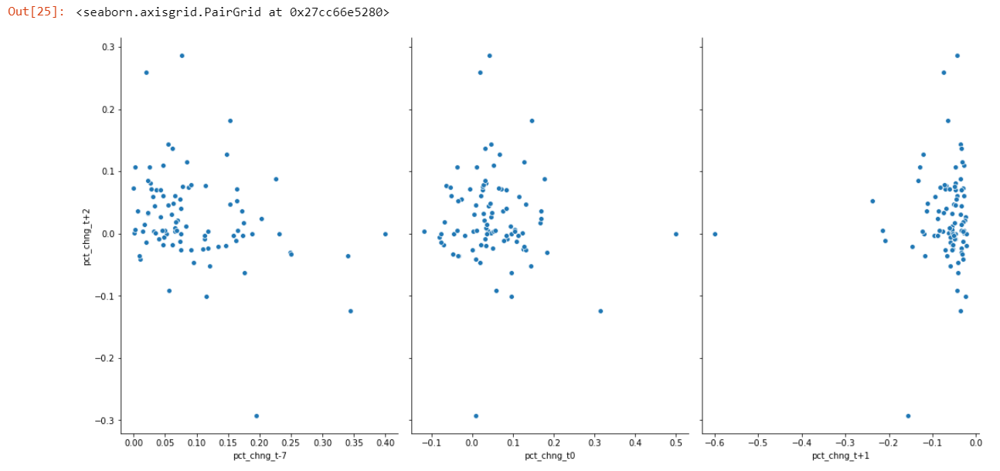 
 

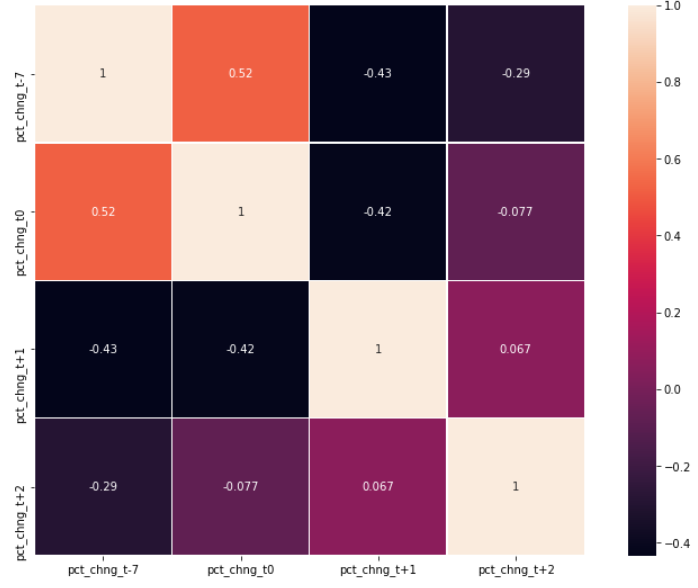 

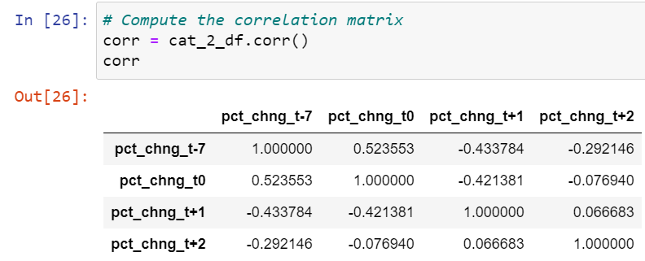 

#### Coefficients:

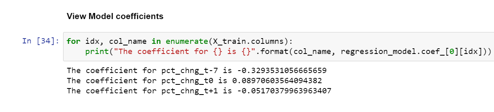 

#### Intercept:

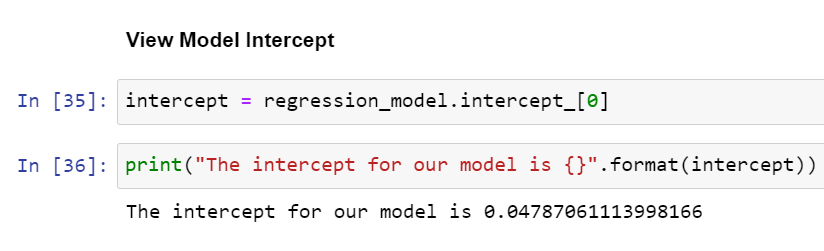 

### Category 2 Conclusion:

The model yielded a negative r-squared score of 0.15739. So in our model, 15.74% of the variability in Y can be explained using X. The mean square error was 0.06074. So, the model was an average of 0.06 percent change away from the ground truth percentage when making predictions on our test set.

## Category 3:
11 of the 234 data points fell into category 3.

Price change in the week preceding the announcement date and  Price change on announcement day independent variables showed a strong negative correlation with the response variable. 

The strongest correlation variable was the price change in the week preceding the announcement date (-0.88). 
 

## Visualizations:

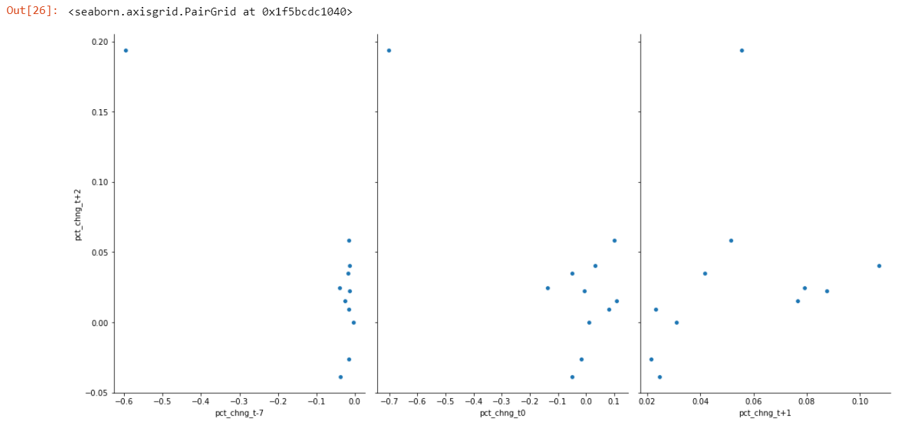 
 

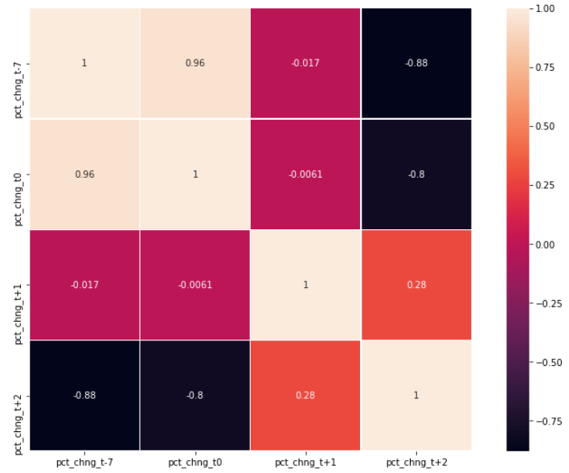 

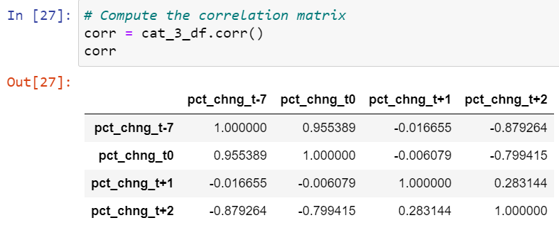 

#### Coefficients:

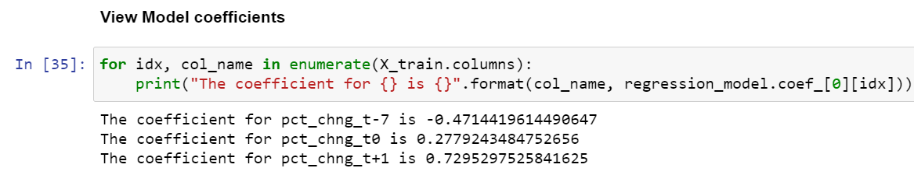 

#### Intercept:

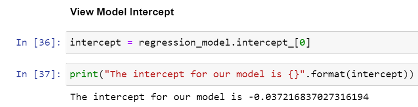 

### Category 3 Conclusion:

The model yielded a negative r-squared score of 0.20497. So in our model, 20.50% of the variability in Y can be explained using X. The mean square error was 0.07126. So, the model was an average of 0.07 percent change away from the ground truth percentage when making predictions on our test set.

## Category 4:
33 of the 234 data points fell into category 4.

None of the independent variables showed a strong correlation with the response variable. 

The strongest correlation variable was the price change on announcement day (0.41). 
 

## Visualizations:

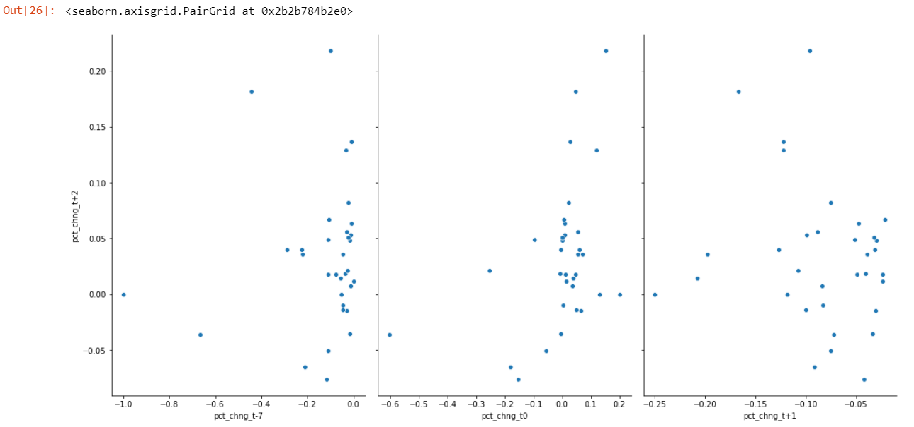 
 

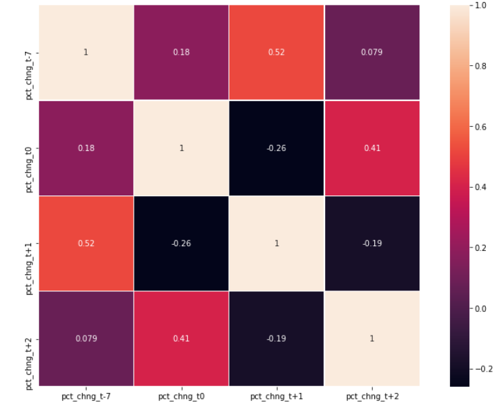 

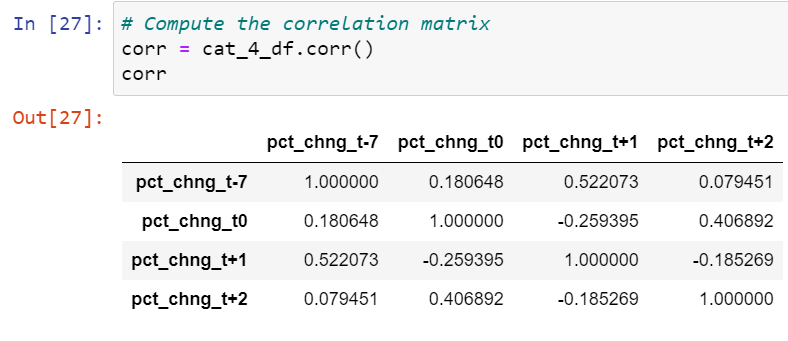 

#### Coefficients:

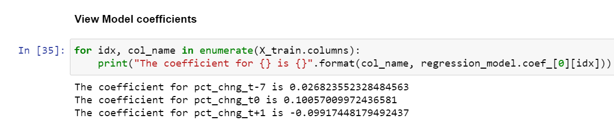 

#### Intercept:

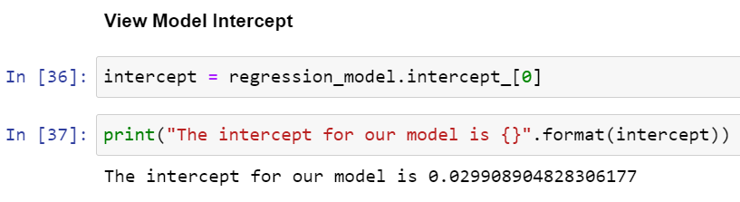 

### Category 4 Conclusion:

The model yielded a negative r-squared score of 0.19152. So in our model, 19.15% of the variability in Y can be explained using X. The mean square error was 0.07302. So, the model was an average of 0.07 percent change away from the ground truth percentage when making predictions on our test set.

## Future Analysis:

We were unable to observe an earnings announcements affect on future stock prices in our dataset and model. A more robust dataset could produce different results, as this dataset was limited. 

Additionally, it would be interesting to observe the daily and weekly changes and compare it to the daily change on announcement day and each day after the announcement day for the next month. And then compare these changes to the average daily, weekly change.

For example, find ALE daily, weekly, monthly price changes from 01/01/2020 - 10/31/2020. Take the avg so that there is an avg daily change, avg weekly, avg monthly change. Then compare these changes to pct changes on announcement day and after. And observe if the avg change comparison is significant (e.g. if the change is >=2%).

