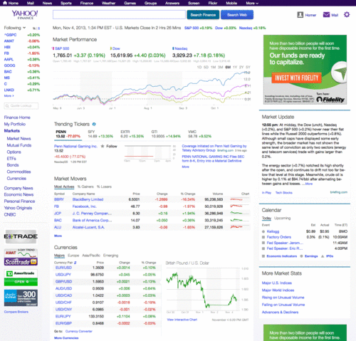
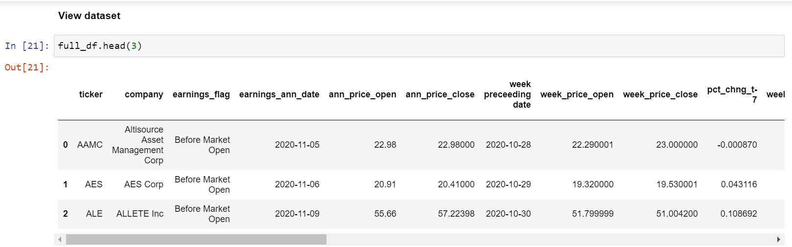
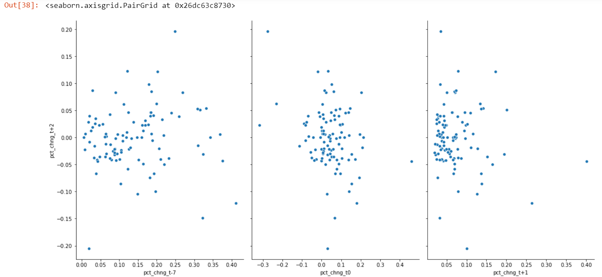
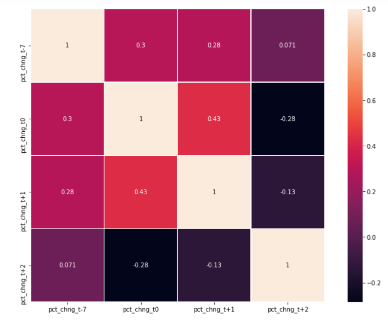
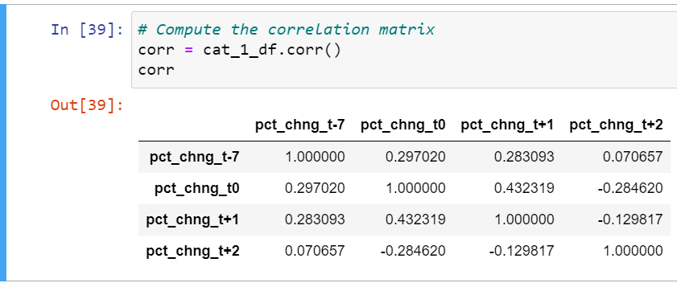
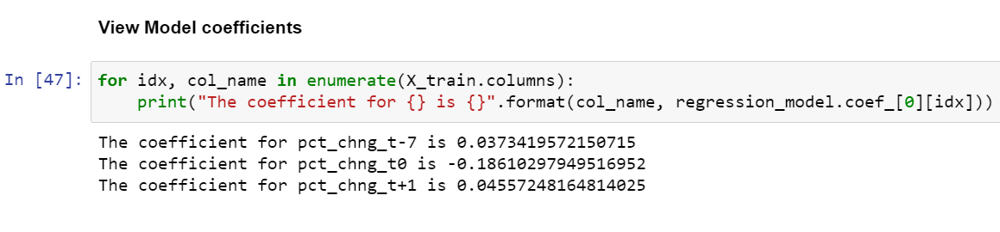
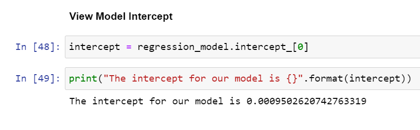

# Stock Price Analysis | Earnings Announcements 

## Background

The purpose of this analysis is to examine how earnings announcements affect the behavior of future stock prices. 

 

## Analysis Question
Does movement on the day after earnings predict movement in the following periods (day, week, month)?

## Dependent Variable:
Price change in close price of one day after earnings announcement and close price of two days after earnings announcement date

## Independent Variables:
1) Price change in the week preceding the announcement date
(announcement day close price - week preceding close price) 

2) Price change on announcement day.
(day proceeding announcement day close price - next trade day after announcement day open price) 

3) Price change on next trade after announcement day
(next trade day after announcement day open price - next trade day after announcement day close price) 

## Data Source and Data Collection:
Yahoo Finance earnings calendar API was used to collect earnings date data. Yahoo Finance stock price API was used to collect history stock price information.

 

### Testing categorization
The companies were broken up into four categories:

#### Category 1:
Increase in preceding week, increase in first trading day after announcement

#### Category 2:
Increase in preceding week, decrease in first trading day after announcement

#### Category 3:
Decrease in preceding week, increase in first trading day after announcement

#### Category 4:
Decrease in preceding week, decrease in first trading day after announcement

#### Criteria:
In order to be considered in the analysis, a company must fall into category 1-4 and its change in the trade day after announcement day must be greater than or equal to two percent.

## Results
A total of 234 companies met the criteria for analysis. 

 

A Linear Regression Model was trained and tested on the dataset.

#### Category 1:
100 of the 234 data points fell into category 1.

None of the independent variables showed a strong correlation with the response variable. 

The strongest correlation variable was the price change on announcement day (-0.28). 
 

 
 
 

 
 

#### Coefficients:

 

#### Intercept:

 

### Category 1 Conclusion:

The model yielded a negative r-squared score of -0.003. Note that it is possible to get a negative R-square for equations that do not contain a constant term. Because R-square is defined as the proportion of variance explained by the fit, if the fit is worse than just fitting a horizontal line then R-square is negative. In this case, R-square cannot be interpreted as the square of a correlation. Such situations indicate that a constant term should be added to the model. The mean square error was 0.058. So, the model was an average of 0.06 percent change away from the ground truth percentage when making predictions on our test set.

